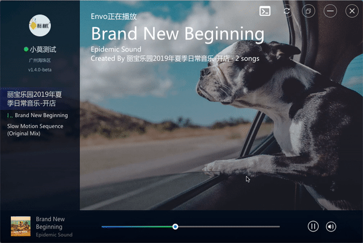

# ENVO背景音乐

## 应用场景
基于互联网的模式，通过专业的音乐编辑师进行音乐进化的编排（包括轮播语音、插播语音、音乐列表），为店铺/商场定制场景化音乐。

## 技术架构
- React v16.x，组件开发框架
- Webpack 4.x，打包编译工具
- Dexie 2.x，浏览器本地数据库
- Eelectron 4.x，桌面端开发框架
- Java 8, 后台
- Postgres, 数据库
- Springboot, 项目框架

## 项目预览

